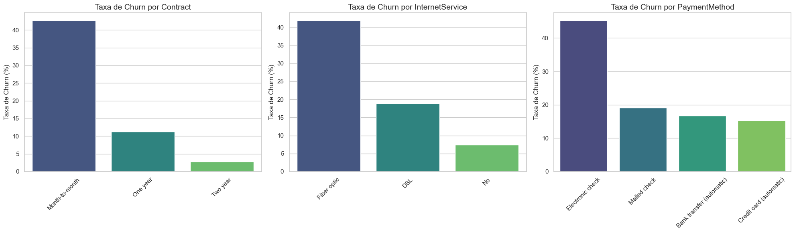
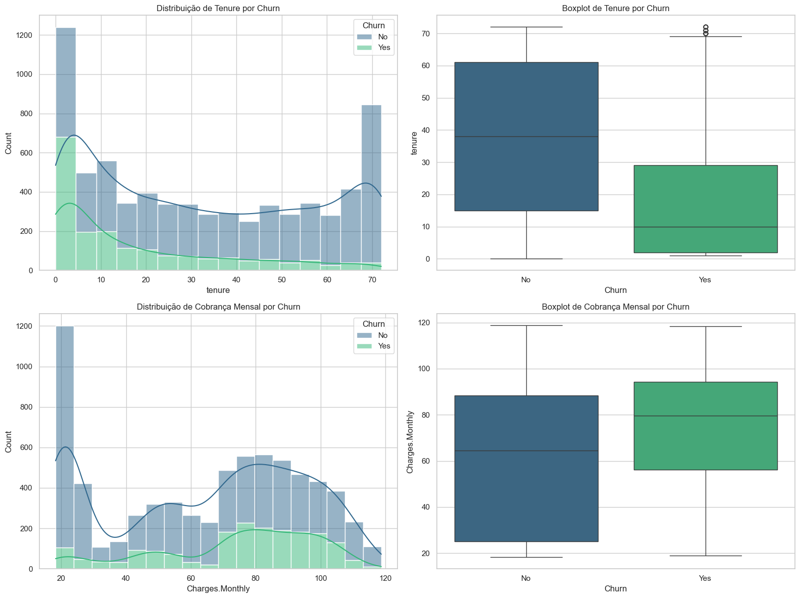

# Projeto Telecom - Previsão de Churn

## Resumo do projeto

Este projeto tem como objetivo analisar dados de clientes de uma operadora de telecomunicações e construir modelos preditivos para identificar clientes com maior risco de cancelamento. O trabalho foi dividido em cinco fases principais:

---

## 1. Limpeza e pré-processamento dos dados
- **Remoção de registros inválidos e tratamento de nulos**: Especial atenção à variável alvo `Churn` e à coluna `Charges.Total`.
- **Codificação de variáveis**: Binárias, ordinais e nominais, utilizando mapeamento manual e One-Hot Encoding.
- **Validação de consistência**: Garantia de integridade entre colunas de serviços.

## 2. Análise Exploratória de Dados (EDA)
- **Churn desbalanceado**: Aproximadamente 26,5% dos clientes cancelaram o serviço.

- **Principais achados**:
  - Contratos mensais têm maior taxa de churn.
  - Clientes de fibra óptica e que pagam via cheque eletrônico apresentam maior risco.
  
  - Clientes com menor tempo de contrato e cobrança mensal mais alta tendem a cancelar mais.
  - Forte correlação entre tempo de contrato e valor total pago.
  

## 3. Modelagem Preditiva
- **Modelos testados**: Regressão Logística, Random Forest, XGBoost.
- **Pipeline robusto**: Inclui padronização, tratamento de desbalanceamento (SMOTE) e validação cruzada estratificada.
- **Melhor desempenho**: XGBoost otimizado, com AUC-ROC superior e bom equilíbrio entre precisão e recall.

## 4. Otimização de Hiperparâmetros e Limiar de Decisão
- **Busca eficiente de hiperparâmetros** para o XGBoost.
- **Ajuste do limiar de decisão**: Pequeno ganho de precisão (de 51% para 54%), com leve redução no recall. O modelo final é tecnicamente superior, mas o avanço é modesto.

---

#### Comparação Direta das Métricas (para a classe Churn = 1)

Para visualizar o impacto do ajuste, vamos comparar as métricas lado a lado:

| Métrica (para Churn=1) | Limiar Padrão (0.5) | Limiar Otimizado | Mudança (Variação Percentual) |
|:---|:---:|:---:|:---:|
| **Precisão** | 0.51 | **0.54** | **+5.9%** |
| **Recall** | 0.80 | **0.76** | -5.0% |
| **F1-Score** | 0.62 | **0.63** | **+1.6%** |

---

## 5. Recomendações Estratégicas
- **Engenharia de novas features**: Prioridade máxima para ganhos futuros.
- **Análise de custo-benefício**: Sugerida para maximizar o retorno financeiro das ações de retenção.
- **Comunicação clara aos stakeholders**: O modelo está refinado, mas novas melhorias dependem de dados mais ricos.

---

## Principais Conclusões
- O modelo XGBoost otimizado é a melhor escolha atual, oferecendo bom equilíbrio entre precisão e recall.
- O maior potencial de melhoria está na criação de novas variáveis e na análise de valor do cliente.
- O projeto está pronto para ser integrado a estratégias de retenção, com recomendações claras para evolução futura.

---

**Data da análise:** Agosto/2025

**Autor:** Ebenézer Carvalho

---

> Para detalhes completos, consulte o notebook `projeto_telecom_final.ipynb`.
